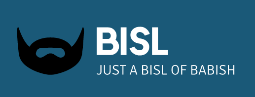

## Bisl
Bisl is an app for exploring the recipes created by Andrew Rea, aka Oliver Babish, through his Youtube channel, Binging with Babish

## Motivation
Often when cooking, it is difficult to look up recipes on the web or YouTube. This project was created to help fans of Binging with Babish have quick and native access to all of the Binging recipes right on their phone while cooking.

Furthermore, social features for saving and sharing recipes with friends would be nice to have.

Thus Bisl was born.

Oh, and the name Bisl comes from the Yiddish word that mean, "a little bit of something, a tiny piece"

## Build status


## Code style
This project strictly follows Python PEP8 and Django coding standards. In addition, industry best practices are followed closely. Read more about best practices and processes in the [project docs](https://github.com/jmichelsen/bisl__backend/tree/master/docs) 
 
 ## Screenshots
To be added

## Tech/framework used

<b>Built with</b>
  - [Django](https://www.djangoproject.com/) for recipe management
  - [Django REST Framework](https://www.django-rest-framework.org/) for the API
  - [CircleCI](https://circleci.com/) for continuous integration and deployment
  - [Heroku](https://heroku.com/) for hosting

## Continuous Integregation ad Deployment
Info about how this is set up

## General Design
To be added

## Installation
To run Bisl locally, pull the project and use the following `docker-compose` commands:
```bash
$ docker-compose up bisl
```

That will build the project from the Dockerfile, run migrations, and start the local webserver. You can then access the project on host `http://0.0.0.0` and port `8009`:
```bash
http://0.0.0.0:8009/
```
## API Reference
To be added

## Tests
Tests can be run through docker-compose, like the project itself:
```bash
$ docker-compose run --rm bisl pytest
```

## Contribute
Contributions are always welcome! Please read the [contributing guideline](CONTRIBUTING.md) first.


## Credits
Built by [Jesse Michelsen](https://github.com/jmichelsen), [Jmast](https://github.com/jmast02), [Clem](https://github.com/ClemSau)

## License
GNU General Public License v3.0

GNU GPLv3 © [Jesse Michelsen](https://github.com/jmichelsen)
